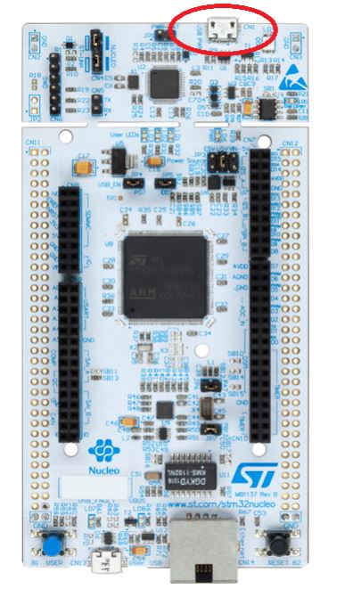

# Linux Setup Guide

## Overview
Linux Installation - Install CSSE3010 source and tools directly on Ubuntu (Not using a VM). You can install the CSSE3010 source and toolchain onto Ubuntu, directly. NOTE: You must first have your git account setup BEFORE attempting this.

## Ubuntu Automatic Script installation
The automatic script will download and install the required packages, add the sourcelib_env.sh script to your .profile startup script and add your user name to the “dialout” group.
 
1. If you have not yet done so, clone the sourcelib repository into your csse3010 directory using `git clone https://github.com/uqembeddedsys/sourcelib.git`
2. Go to the sourcelib/tools folder
3. Run the script sourcelib_install.sh as root – i.e. `sudo ./sourcelib_install.sh`
4. The script will download and install part of the toolchain
5. Run `source ~/.profile` 
6. Type `echo $SOURCELIB_ROOT` into your terminal. This command should return a path variable, i.e ~/csse3010/sourcelib
7. Test the compiler with `arm-none-eabi-gcc --version`

## Updating flashing tools

The flashing tools used in this course rely on JLink libraries, JLink is used to communicate with the debugging chip on the board which will then flash the code (amongst doing other things).However the board dy default comes with a different debugging chip, ST-LINK, thus we will need to replace the ST-LINK firmware with JLink firmware. If you are an internal student, this may have already been done for you, and you can try skipping to the next section, external students should read on.

Do the following steps on a Windows machine (Non-VM), if you don't have windows, you can RDP into UQ Computers.

* Download and install the ST-LINK USB Drivers for Windows [ST-LINK](https://www.st.com/en/development-tools/stsw-link009.html)
* Download and install the latest Windows [JLink-Firmware](https://www.segger.com/downloads/jlink/)
* Download the ST-Link Reflash Utility from [Segger](https://www.segger.com/downloads/jlink/#STLink_Reflash)

Run the reflasher -> accept -> [1] Upgrade To J-Link -> [0] Quit

## Verifying JLink

Inside your VM, make sure the nucleo is plugged in, and attached as a device, verify by using `sudo dmesg` and looking at the bottom of the log for newly attached devices, as well as looking for /dev/ttyACM0 when the usb is pluged in and the device is attached to the VM. (Note the nucleo cannot be attached both to the VM and to the Host OS, so if its visible in your Host OS, it isnt attached to your VM)

|  |
|:--:|
| *Figure 1: USB Port you will use|

Execute the following

```
JLinkExe
connect
STM32F429ZI (or other depending on your nucleo)
S
<Enter> (Default)
```

There should be some text ending with Cortex-M4 Identified

```
q (for quit)
```
NOTE: The USB port pictured above should be the only USB port you will need in this course